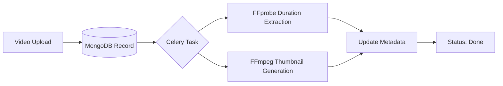

# 🚀 Clipo AI Backend: Scalable Video Processing API

This project implements the Clipo AI Backend Assignment, a video processing API built with FastAPI, MongoDB, Celery, Redis, and FFmpeg. Uploaded videos are stored locally, processed in the background to extract duration and generate a thumbnail, and metadata is stored in MongoDB.


<br>


#  🔥 Key Highlights (What Recruiters Will Notice)

- **Production-Grade Architecture**: Async FastAPI + Celery background tasks + Redis + MongoDB
- **Efficient Processing**: FFmpeg-powered video analysis (duration extraction + thumbnail generation)
- **Containerized Workflow**: Full Docker integration with isolated services
- **Cloud Storage Ready**: Google Cloud Storage integration prepared (see `services/gcs_utils.py`)
- **Clean Codebase**: Modular organization with separation of concerns
- **Professional Practices**: Environment variables, proper error handling, and status tracking

<br>

# 🛠 Tech Stack Deep Dive

| Component       | Technology             | Purpose                          |
|-----------------|------------------------|----------------------------------|
| **API Layer**   | FastAPI (Python 3.10+) | Async REST endpoints             |
| **Database**    | MongoDB                | Video metadata storage           |
| **Queue**       | Redis + Celery         | Background task processing       |
| **Processing**  | FFmpeg                 | Video analysis & thumbnail gen   |
| **Infra**       | Docker Compose         | Container orchestration          |
| **Storage**     | Local/Google Cloud     | Scalable file storage            |


<br>
<br>

  
#  🌟 Core Features

## 1. Intelligent Video Processing Pipeline



## 2. Robust API Endpoints

```
Endpoint                    Method	      Functionality

/api/upload-video/	     POST   	    Securely upload videos (multipart)
/api/video-status/{id}	     GET	    Real-time processing status
/api/video-metadata/{id}     GET	    Retrieve full video metadata
/thumbnails/{filename}	     GET	    Access generated thumbnails
```

## 3. Metadata Management
Stores comprehensive video information in MongoDB:

```
{
  "filename": "demo.mp4",
  "upload_time": "2025-06-14T10:00:00Z",
  "status": "done",
  "duration": "00:05:22",
  "thumbnail_url": "http://cdn.example.com/thumbnails/demo.jpg"
}
```


<br>
<br>
  
# 📂 Directory Structure
  ```
  clipo-ai-backend/
├── app/
│   ├── main.py                  # FastAPI application
│   ├── config.py                # Environment variable settings
│   ├── db.py                    # MongoDB client setup
│   ├── celery.py                # Celery app definition
│   ├── tasks.py                 # Celery tasks (process_video)
│   ├── services/
│   │   ├── ffmpeg_utils.py      # FFmpeg helper functions
│   │   └── gcs_utils.py         # (Optional) Google Cloud Storage
│   └── routers/
│       └── videos.py            # API endpoints
├── celery_worker.py             # Celery worker launcher
├── Dockerfile                   # Docker image for app & worker
├── docker-compose.yml           # Compose services: app, worker, redis, mongo
├── requirements.txt             # Python dependencies
├── .env.example                 # Example environment variables
└── storage/
    ├── videos/                  # Uploaded videos
    └── thumbnails/              # Generated thumbnails
```

<br>
<br>


# ⚡ Quick Start with Docker (Production-Ready Setup)

 
## 1. Configure environment
cp .env.example .env

## 2. Build and launch all services
docker-compose up --build -d

## 3. Access API docs at:
http://localhost:8000/docs

<br>
<br>


#  📋 Environment Variables
   ```
     MONGO_URI=mongodb://mongo:27017/
     DB_NAME=clipo_ai
     REDIS_URL=redis://redis:6379/0
     VIDEO_STORAGE_PATH=./storage/videos
     THUMBNAIL_STORAGE_PATH=./storage/thumbnails
     GCS_BUCKET_NAME=            # Optional: set to enable GCS upload
     GCS_CREDENTIALS_JSON=       # Path inside container to credentials.json
   ```


<br>

# 🔧 FFmpeg Commands
  ## Extract duration (used in extract_duration):
     ```
     ffprobe -v error -show_entries format=duration \
  -of default=noprint_wrappers=1:nokey=1 \
  storage/videos/example.mp4
  ```

  ## Generate thumbnail (used in generate_thumbnail):
     ```
     ffmpeg -ss <timestamp_in_seconds> -i storage/videos/example.mp4 \
  -vframes 1 -q:v 2 storage/thumbnails/example.jpg
  ```

<br>

# 🔄 API Usage Examples

 ## 1. Upload video:
    ```
    curl -X POST "http://localhost:8000/api/upload-video/" \
  -F "file=@/path/to/example.mp4"
    ```

## 2. Check status:
  ```
  curl "http://localhost:8000/api/video-status/<id>"
  ```

## 3. Get metadata:
   ```
   curl "http://localhost:8000/api/video-metadata/<id>"
   ```

## 4. View thumbnail:
     Open in browser:  ```http://localhost:8000/thumbnails/example.jpg```

          
